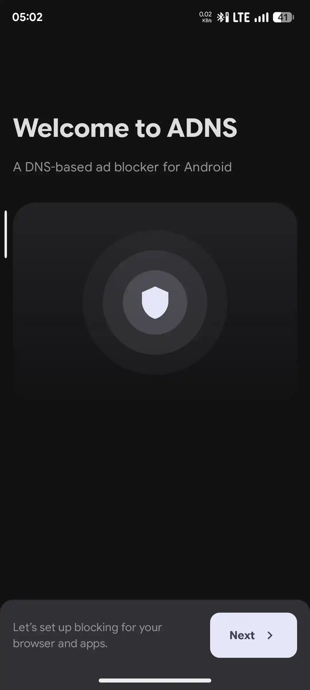
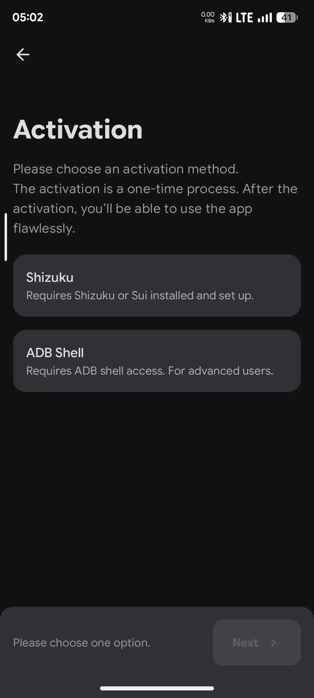

ADNS is a lightweight DNS-based ad blocker for Android. No VPN, no background services, no battery drain, no hassle.

I must say finally there is an alternative for **AdAway** app to blocks Ads for the apps and websites!

As you all may know that AdAway using host file to block ads and else, but the usage of AdAway is kinda a bit slow cause the app will rewrites everything inside host file and then apply it to your device. But ADNS is not using the same method and you even doesn't needs to wait for apply and disable at all cause it's only enable and disable Private DNS.

# NextDNS →
Inside the app, NextDNS is recommended and the most powerful service from this app and it's because the app has exactly the same settings as NextDNS profile. NextDNS is not like another DNS cause we can adjust everything from their Profile set.
# Guides →
- `[Installations →](^^^install1show^^^)
- `[Setup — NextDNS Method](^^^setup1show^^^)`
- `[Setup — Other Providers Method →](^^^setup2show^^^)`
- `[Setup — Private DNS Method →](^^^setup3show^^^)`

^^^install1hide^^^
# Installations →
1. Download the app from [ADNS GitHub](https://github.com/eyalm2000/adns) Releases (Use **FOSS** variant if you care for your own privacy things)
2. Install app like a normal app
3. Open the app and 

^^^install1hide^^^

^^^setup1hide^^^
# Setup — NextDNS Method →

1. Go to **NextDNS** to [Sign Up](https://my.nextdns.io/signup) your first account (For creating a **Profile**)
2. After the account created, open **ADNS** app (This is the screen of first launch of ADNS app)
:::gallery


:::
3. You'll be prompted with 2 options like the screenshot above
	- **Shizuku**: Temporary root access for grant permissions to ADNS app
	- **ADB Shell**: Directly give permissions to ADNS app from terminal commands
4. If you want to use **Shizuku** app, you also needs to use Terminal command to give Shizuku permissions (You can see all guides inside the app, Shizuku is available on [Play Store](https://play.google.com/store/apps/details?id=moe.shizuku.privileged.api) or [GitHub Releases](https://github.com/RikkaApps/Shizuku))
	- **Note**: I once tried to use Shizuku on Android 16 with root access to give permissions, but it didn't work
5. If you want to use **ADB Shell**, you can use Laptop, PC or even Terminal app like Termux on your android rooted app
- Use this for Laptop or PC Terminal
```
adb shell pm grant com.eyalm.adns android.permission.WRITE_SECURE_SETTINGS
```
- Use this for Android Root Terminal
```
su
pm grant com.eyalm.adns android.permission.WRITE_SECURE_SETTINGS
```
6. Once the app can be accessed, you'll see the Settings button on the bottom bar, click it and choose/change the **Provider** to **NextDNS** (You'll be asked to login, login to your NextDNS account that you just created and click Next)
7. Back to **Home** menu of NextDNS app, click Run to start using NextDNS and all done!

# Details →
Why is NextDNS recommended and powerful? It's because this method will 100% works and has fully control of “yourself” profile, it means you can set the profile as you wish such as:
- Enable and disable any Ad blacklist (ad filter)
- Enable and disable tracking from smart devices
- You can even use this for **Parental Control** to disable internet from the selected apps
- And more! It is really so many settings for your profile, you can check and set your profile from **[NextDNS](https://my.nextdns.io)** site or inside **ADNS** app

^^^setup1hide^^^

^^^setup2hide^^^
# Setup — Other Providers Method →
for other **Provider** such as:
- AdGuard DNS
- Google DNS
- Cloudflare DNS

This method is very easier but not recommended (not powerful), simply click on those DNS provider and Run, done.

# Details →
Why is it not powerful? It's only use a public DNS from providers own profile and cannot be manually set like NextDNS.

^^^setup2hide^^^

^^^setup3hide^^^
# Setup — Private DNS Method →
This method is also simple but still needs to sign up for NextDNS account to create the profile
1. Open [NextDNS](https://my.nextdns.io/) site
2. Inside **Setup** menu, you'll see **DNS-over-HTTPS** with URL below it
3. Copy the URL and go to your device settings
4. Find Private DNS and paste the copied URL there, done

# Details →
You can setup your Profile from NextDNS site

^^^setup3hide^^^