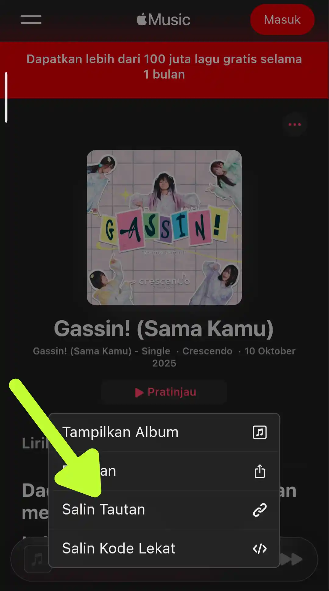
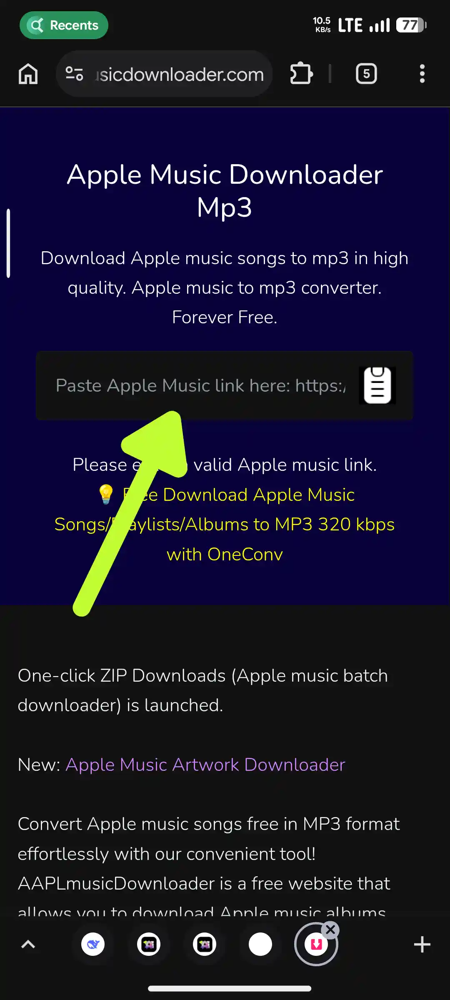
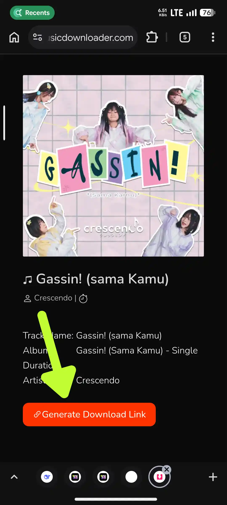

Some of you may be the persons who always plays music via your own local playlist like downloaded and play it with local music player. But download free music from YouTube or any other platform is always got a low resolutions. I'll guides you to how to get a free music with and original quality from the music itself from **Apple Music**!
# Guides →
1. Open **[Apple Music](https://music.apple.com/)** website and search for any music that you want to download
2. Find it? Now copy the url of the music by click on the 3 dots and click **Copy link** or long press the music title and **Copy link**

3. Open this **[Apple Music Downloader](https://aaplmusicdownloader.com)** website
4. Paste the music link to the **Apple Music Downloader** website input

5. Wait website to do the process
6. Once it done, you'll see your music details in the page, Click **Generate Download Link** button

7. Once again, you'll be asked to choose which audio resolution do you want to download, choose **M4a (Original Audio)**
8. New tab will be launched to download your music, click download and your music will be available to played with Original Resolution!

# Notes →
This website can only download 3 songs a day!