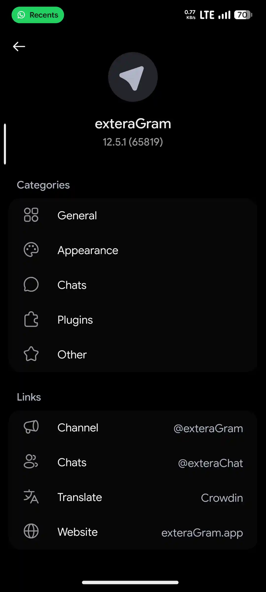
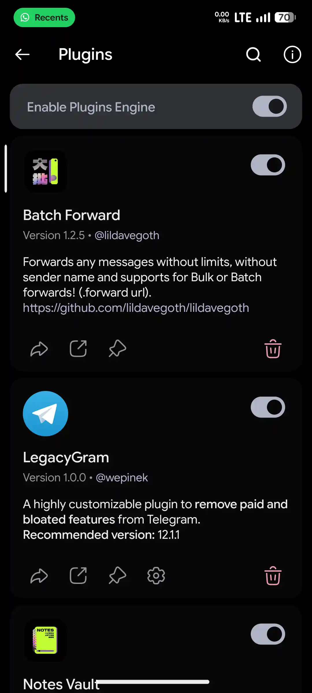

The most powerful **Telegram** mod that i ever used all the time. This Telegram mod has so many features and even a **Plugins** to improve and change how Telegram works! Like remove **Ads** completely, remove **Paid** features, and even adding new features such as **RSS Feeds**, **Text Animation** when typing, **iOS Context Menu**, and even a **NES Emulator** inside exteraGram!

:::gallery

:::

You could never imagine what could possibly can do with Plugins of exteraGram cause they have so many useful Plugins. I also been made some Plugins in my GitHub, but maybe it's not really useful for you because i made it based on what i needed.
# My Plugins →

> **Batch Forward**

Forwards any messages without limits, without sender name and supports for Bulk or Batch forwards!

> **Notes Vault**

Store all your private notes without a notes app!

> **URL Cleaner**

An updated version of Insta URL Cleaner plugin by [@ravana69](https://t.me/ravana69)

This plugin has been updated with YouTube supported, that's why the name of plugin is changed.

# Guides →
- `[Installations](^^^installations1show^^^)`
- `[Enable & Install Plugins](^^^plugins1show^^^)`
- `[My Plugins Guides](^^^mypluginguides1show^^^)`

^^^installations1hide^^^
# Installations Guide →
1. Open [exteraGram Releases](https://t.me/exteraReleases) channel and download latest APK (I currently using Full version and not Lite)
2. After the file is downloaded, click the APK and install it as usual APKs
3. That's all

^^^installations1hide^^^

^^^plugins1hide^^^
# Enable & Install Plugins →
**Enable Plugins**
1. Of course you need to sign in to your Telegram account first
2. Open **Settings** and click **exteraGram Preferences**
3. Open **Plugins**, and Enable it by click the toggle
4. Once it's enabled, you'll need to install **Plugins** to use it

**Install Plugins**
1. Open [exteraGram Utilities](https://t.me/exteraPluginsSup) channel
2. You'll see so many Plugins inside the channel, find what you need
3. Found it? Download it, and after it's downloaded, you'll be asked to **Install** the plugin, also with small detail: There's a checkbox to Enable plugin after installation, you can check it for faster enable without needed to open exteraGram Plugins menu
4. Your downloaded Plugin is enabled already? Now read how to use your downloaded Plugin to be able to use it

`[Confused? Let me explains by using my own Plugins instead.](^^^mypluginguides1show^^^)`

^^^plugins1hide^^^

^^^mypluginguides1hide^^^
# My Plugins Guides →
I'm sorry but my Plugin is not shared in any Telegram channel or on the official exteraGram Utilities because i'm using it for myself since i made them but i publish them in my GitHub as a backup and for anyone wants to use it. [Download here →](https://github.com/lildavegoth/lildavegoth/tree/homepage/telegram/exteragram-plugins)

You must download the Plugins file and upload it to your Telegram saved message to be able to install the Plugins.

# Batch Forward →
1. Download, Install and Enable **Batch Forward** plugin
2. Follow this video guides

# Notes Vault →
1. Download, Install and Enable **Notes Vault** plugin
2. Follow this video guides

# URL Cleaner →
1. Download, Install and Enable **URL Cleaner** plugin
2. Follow this video guides

^^^mypluginguides1hide^^^