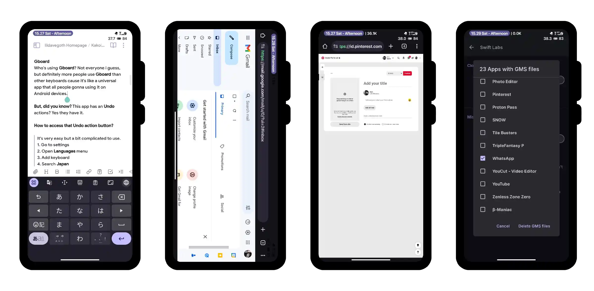
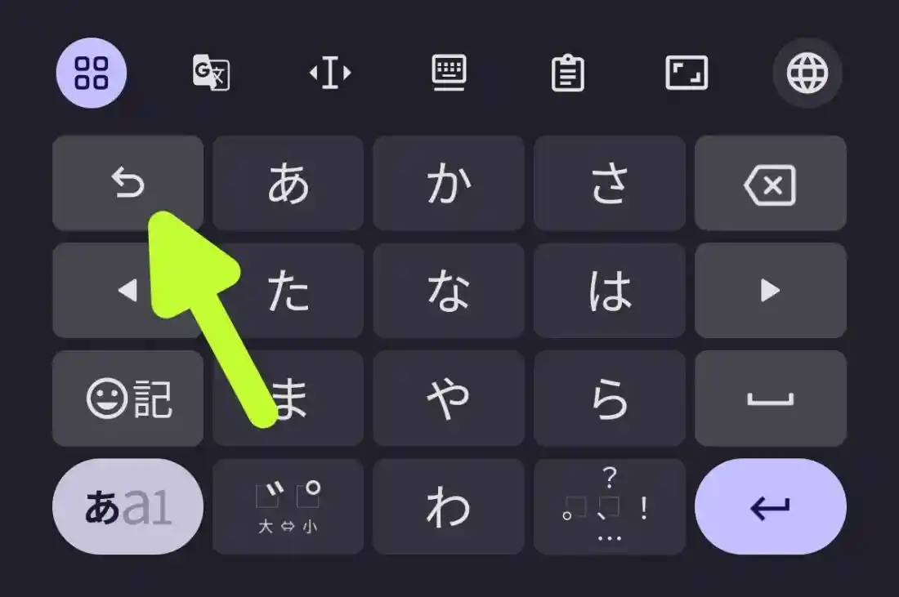
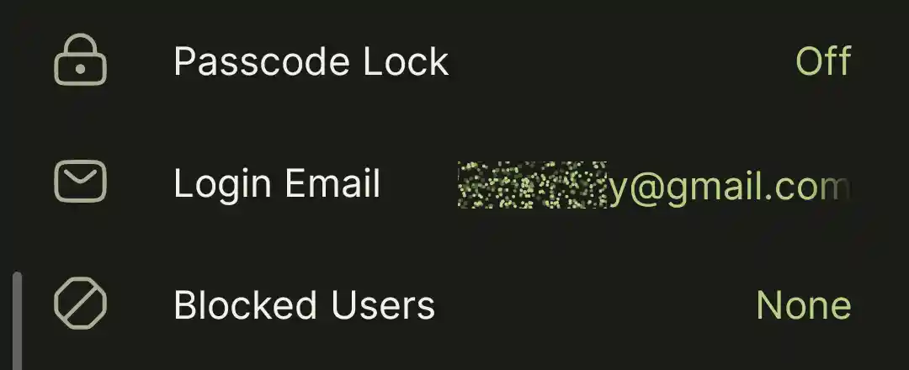

Recently, i was thinking and finds some things that i never knew but it's already there all this time. So i decided to create this article for you and maybe helps you in other days.
This article may be updated in the future, so stay tuned for more information that will amaze you! Shall we start now? Enjoy reading.

# Fun Facts
- `[GBoard →](^^^gboard1show^^^)`
- `[Google Apps →](^^^google1show^^^)`
- `[Kustom Industries →](^^^kustom1show^^^)`
- `[MiXplorer →](^^^mixplorer1show^^^)`
- `[Pinterest →](^^^pin1show^^^)`
- `[Swift Backups →](^^^swiftb1show^^^)`
- `[Telegram →](^^^telegram1show^^^)`

^^^gboard1hide^^^
# GBoard →
Who's using GBoard? You? Better think about it again 😭 But definitely more people use GBoard than other keyboards cause it's default app for most Android devices.

But, did you know? This app has an hidden **Undo** actions? Yes they have it.

# Guides →
1. Go to settings
2. Open Languages menu
3. Add keyboard and search for Japan
4. Choose whatever you want but i prefer to choose the first one
5. After adding the language, open GBoard on a text edit
6. Change the language of keyboard to Japan by hold press on the spacebar or open expanded toolbar and click on next language
7. You'll see the undo icon on the top left of the keyboard, click the undo action for undoing the last typing character

# Notes →
This method are not useful anymore cause in latest GBoard app, Undo action has already available for everyone and not hidden anymore i guess? I once see it on Lunaris AOSP with Android 16, they use GBoard as default system keyboard, and there's an Undo action on it, but i don't know it's real or the app flag has been edited by default.
^^^gboard1hide^^^

^^^google1hide^^^
# Google →
There is no way you don't know what Chrome is. Chrome is the most widely used browser app by peoples.

But did you know? Almost apps that Google have and made is a web based apps? The actual apps from Google is web based and not an APK, EXE or anything. That's why you can access them with any browser apps.

# Guides →
1. [Open this URL →](https://about.google/products/?tab=mh#all-products)
2. Click on Browse all products button
3. And you'll see all Google apps there
4. Click or open any apps that you want and you'll be able to use them in your browser

# Notes →
Some of the apps may only can be accessed or better experience in **Desktop Mode**.
^^^google1hide^^^

^^^kustom1hide^^^
# Kustom Industries →
All the **Kustom** apps is just too great for some of you that always care about how your devices looks, their homescreen setup (**KLWP**), their lockscreen display (**KLCK**), and even the widgets (**KWGT**). Kustom Industries comes with so many features and always be a great app for making a setup and home screen showcases.

But did you know? All of the **Kustom** apps is draining your battery. You know what? Actually make those apps running in the background is unnecessary cause the app will always run ans refresh when you're seeing it. Also you can handle it to make your battery usage last longer while using **Kustom** apps.

# Guides →
1. Go to **Kustom** app info
2. Click on the battery usage or related menu with battery (Some ROMs or Device may have a different menu)
3. Set the battery usage of Kustom apps to Restricted

That's all! The app will stopped when you're not using it now, like **KWGT** for example, the app will stopped when you're not in home screen, and will starts and refreshed when you're in home screen, and so on for other **Kustom** apps.
^^^kustom1hide^^^

^^^mixplorer1hide^^^
# MiXplorer →
Who doesn't know about **MiXplorer** most everyone knows it and use it for their daily **File Manager**. But why? it has too many features and abilities! Let's talk about the features later, for now, i'll guides and amaze you with the abilities.

# Cloud Storages →

Some of you may not know about this, but **MiXplorer** can actually open **Cloud Storage** directly from **MiXplorer** app! But how? It's simple, follow the step!

# Guides →
1. Open **MiXplorer** app and click Plus (+) button
2. You'll see **Storage** over there, click it
3. And inside **Storage** menu, you'll see some **Cloud Storage** that **MiXplorer** supported
4. Click whatever **Cloud Storage** that you actually use and sign in to your account

You'll be asked to sign in to your account and not sign up, because **MiXplorer** is a **File Manager** and not a browser app. If you don't have the **Cloud Storage** account yet, create one in your browser app.

# Supported Cloud Storages →

| **Apps**     | Sites                                  |
| ------------ | -------------------------------------- |
| Mega         | https://mega.nz/register/register      |
| Google Drive | https://drive.google.com/drive/mobile/ |
| Dropbox      | https://www.dropbox.com/register       |
| Box          | https://www.box.com/personal           |
| OneDrive     | https://onedrive.live.com/signup       |
| Mediafire    | https://www.mediafire.com/signup/      |
| Yandex       | https://360.yandex.com/disk/           |
| 4Shared      | https://www.4shared.com/signup.jsp     |

^^^mixplorer1hide^^^

^^^pin1hide^^^
# Pinterest →
Some of you must be familiar with the Pinterest. Yes, there are so many inspiring things there, starting from furnitures, designs, arts, etc. Pinterest is a great place to murder your thirst for inspirations.

# Search Images →
Did you know? You can search an images inside of Pinterest app.

# Guides →
1. Open the Pinterest app and click on search button (Search icon)
2. Then you'll see a camera icon on the top right of your screen
3. Click on it and open the gallery menu to upload and search the image on Pinterest

---

# Carousel Posts →
Did you know? You can upload 5 images to Pinterest at a time at one post on mobile devices like a **Carousel Images**.

# Guides →
1. Open your browser app
2. [Open this URL →](https://pinterest.com/pin-builder/) (Of course you need to login first)
3. Active the **Desktop Mode**
4. Upload first image (**MUST ONLY CHOOSE ONE FOR THE FIRST IMAGE**)
5. Clik **Create Carousel** button to be able to add new images

# Notes →
Must **FOLLOW** the number 4 of this guides cause it is very needed, when you upload 2 or more images at a time, it will crop your images into 1:1 reso like a square and ignore the original size of the image.
^^^pin1hide^^^

^^^swiftb1hide^^^
# Swift Backups →
**Swift Backups** is an app and data backup for Android that needs root or shizuku service to run, and this app can backup the entire data of apps and games, you don't need to relogin or even redownload game resources data for changing ROMs.

But, did you know? This app has an Experimental Features? Yes they have it.

It's called **Swift Labs**. in **Swift Labs**, you can some things that might helps you, and that is **Delete GMS** files of apps. What is this for? It's very needed when you're change a rom from one to another one, but sometimes, after changing ROM you can't receive notifications from apps until you open it. Well this features will helps you with that, **Swift Backups** will delete all **GMS** files on all selected apps and you'll receive notifications from all apps again from now on.

# Guides →
1. Simply go to settings
2. Scroll to the bottom
3. Click on **Swift Labs**
4. And then open **Delete GMS** files of apps
5. Select any problematic notification apps
6. Click Delete GMS files and all done
^^^swiftb1hide^^^

^^^telegram1hide^^^
# Telegram →
Telegram, the most powerful social app with unlimited free cloud storage, and also has a massive members of groups, also useful and powerful bots built by community.

# Account ID →
As you all know, every Telegram users/accounts are always have an ID for each accounts. but how did you find your own ID?

> **First Method**
- Install Telegram mod clients such as Nekogram, Telegram X, exteraGram, etc
- Open the telegram and login to your account
- Swipe right on the home page
- Open your profile
- And you'll see your ID (it's a number with 9 digits)

> **Second Method**
- It's for those of you who are using original Telegram app
- Open the Telegram app and login to your account
- Go to system settings (not Telegram settings)
- Search for Passwords & accounts page
- And you'll see a Telegram app icon with numbers on it, it's your account ID

> **Third Method**
- Using Telegram bot
- Open your Telegram app and login to your account
- Search for @CekIDTelegram_bot
- Press Start button
- The bot will send you your ID

# Email →
And did you know? Only lucky old accounts can have an email verification in their Telegram account.

Yes it's true, but now and on the futures, all new Telegram account can have it. All you need to do is just create a new account, and telegram app will ask you to input your email for verification.

^^^telegram1hide^^^