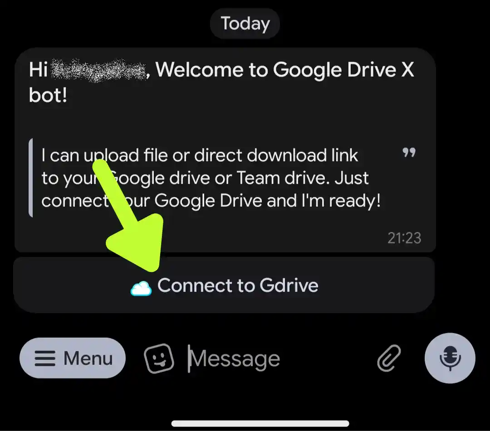
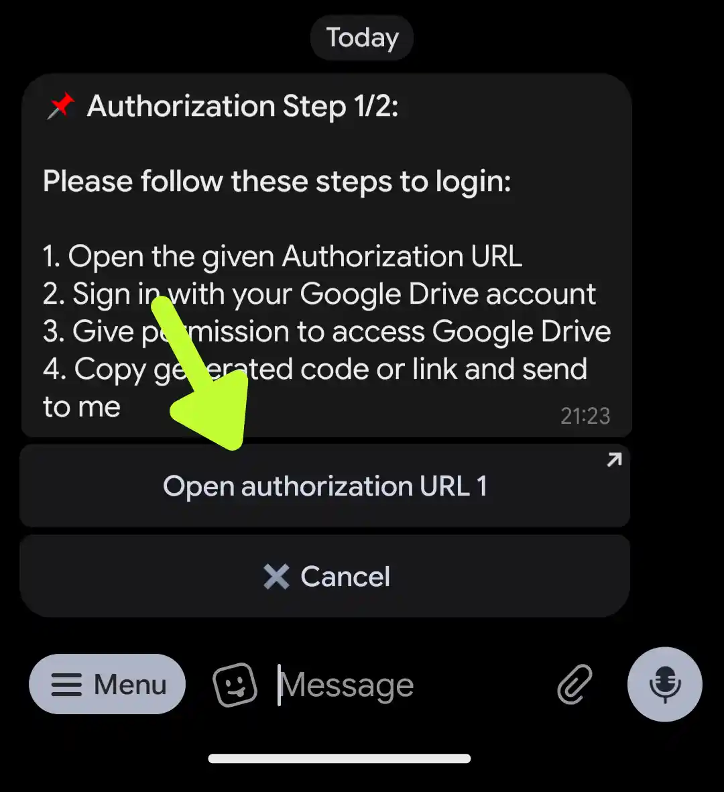
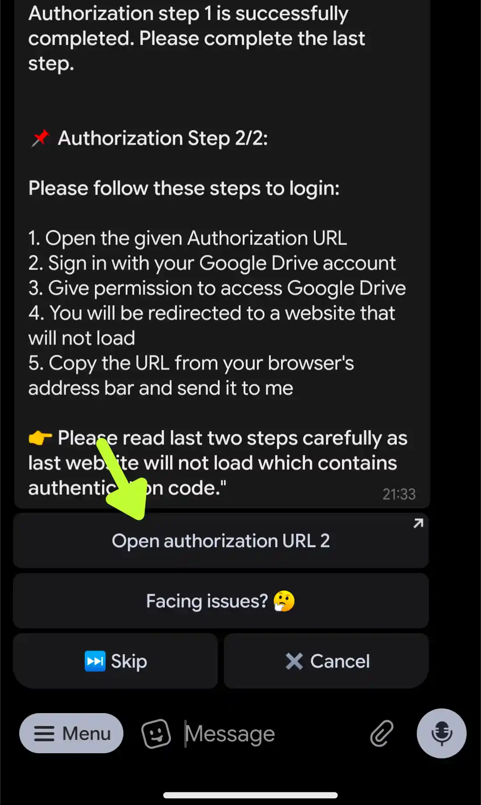
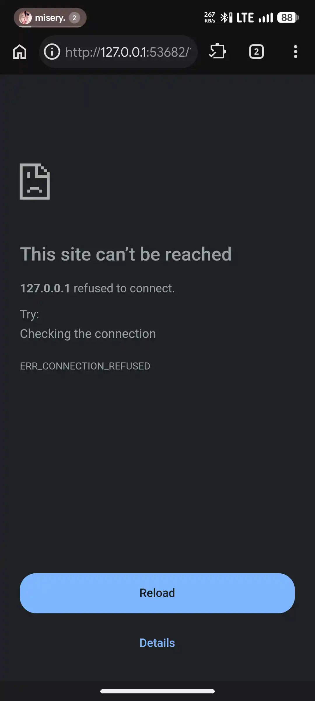
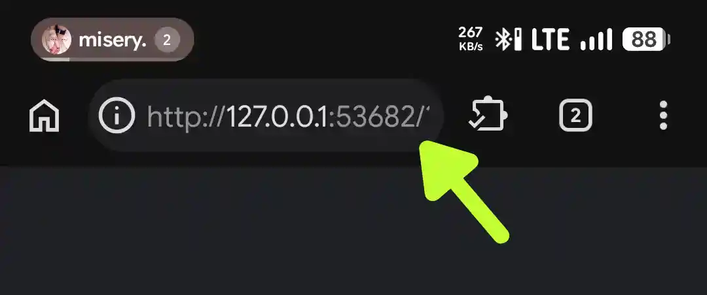
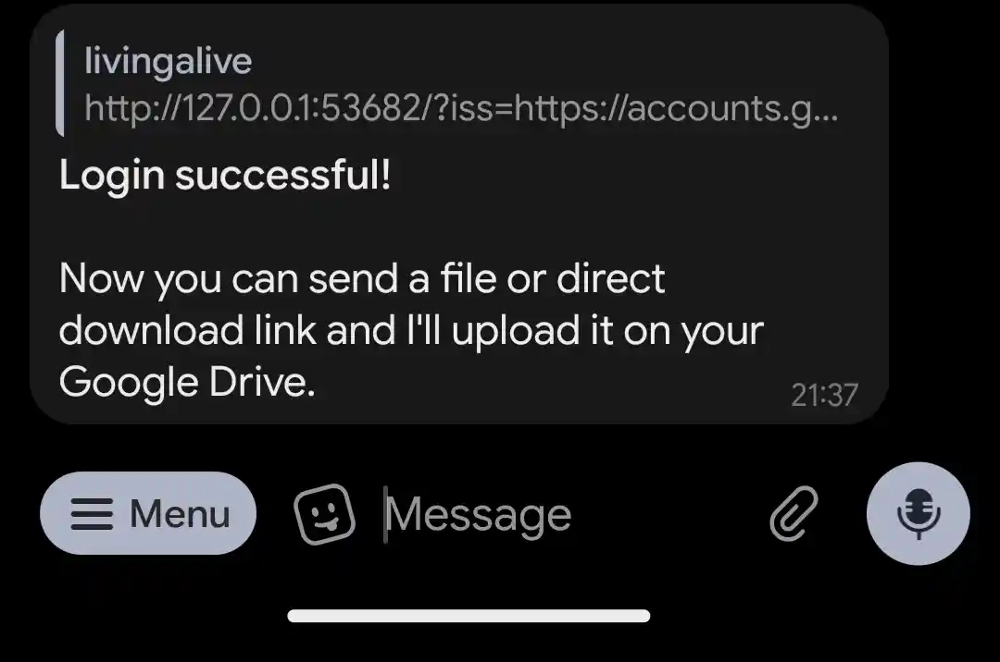
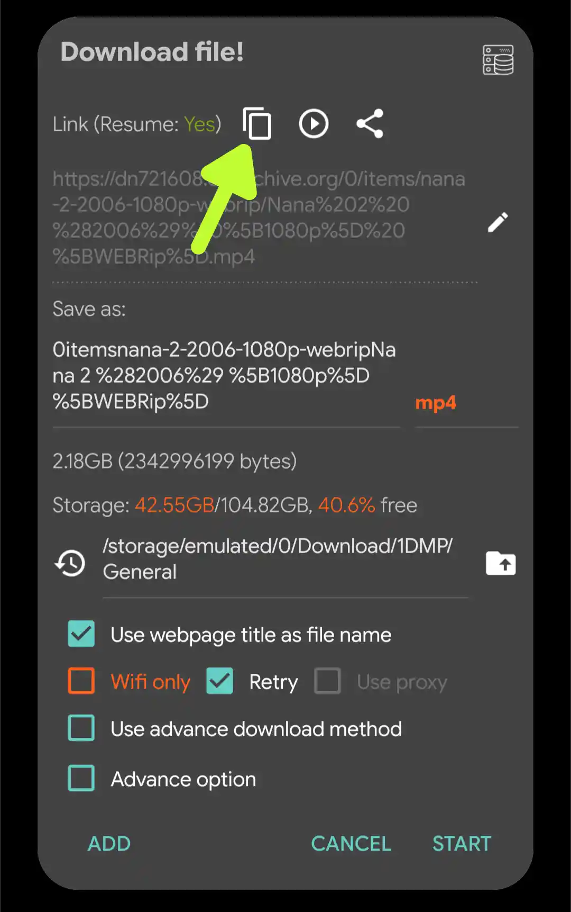

This is the fastest **Google Drive Mirror Bot** that has free plan, but because this is free, of course there are some usage limitations of the bot, i'll tell you everything in this **Article**, so read them carefully and don't miss one to be able to use the bot without problems.
# About →
This **Google Drive Mirror Bot** was made by [@MaheshMalekar](https://t.me/MaheshMalekar) with ability to mirror or remotely download & upload any files on the internet to be saved or reuploaded to your own **Google Drive** for faster downloads.

This Bot does has limitations for free users, but not the speeds of mirroring (Downloads & Uploads), it has limitation but only for the daily usage, every users can only use the bot for free 5 times a day, also you must wait for 15 minutes every after mirroring. Feels not enough with this free stuff? Go upgrade your plans to use the bot, it's available in /help and click **Plans** button or contact the owner for more information.
# Guides →
> **Connect Google Drive Account**
1. Open your Telegram app and go to the [Bot](https://t.me/TheGdriveXBot)
2. Click **Start** button, you'll be asked to **Connect to Drive** (It's simply **Login** to your own **Google Drive** account that you want to use, you can use second or third **Google** account if you don't trust the Bot's developer)

3. When you click **Connect to Drive** button, the buttons will changed to **Open authorization URL 1** (What is this? It's just a method for the bot to sign you in and connect to your **Google Drive** account)

4. Click the **Open authorization URL 1** button, you'll be redirected to a browser app and you must choose one of your **Google** account (Allow or Continue everything asked by Google)
5. After Continue and successfully signed in, you'll be jumped to this URL: `https://botx.netlify.app` (Don't worry, it's fine and not an ads)
6. Inside `https://botx.netlify.app` URL, you'll see a random characters with **Copy to Clipboard** button, click the button to copy the entire characters or just copy the entire codes (characters) if not copied by using the button.
7. After **Copied**, back to the **Telegram** app and paste the Copied characters to the bot
8. When the codes correctly pasted to the bot, you'll be asked to **Open authorization URL 2**, click it and sign in using **THE SAME** Google account!

9. You'll facing an error inside your browser after signed in to your Google account, don't worry, it is how it works

10. Open your **Browser Search Bar** and **Copy** all the URL inside it

11. Open Telegram app and paste the entire copied URL to the bot, the bot will sent you a notification that you're successfully logged in

12. You're ready to go, just sent any **Direct Download** URL to the bot, and this Bot will do the rest!

> **Disconnect Your Google Account**

1. Type /logout and then sent it to the bot
2. You'll be asked to remove account from the bot, click **Yes** button
3. That's all

> **Mirroring**

- To be able to mirror any files, you need 2 things, your Google account has been successfully connected to the bot and **Direct Download URL**
- After account has been connected, as i say before in Connect account guides, just simply sent the direct download url to the bot, bot will do the rest and your file will be saved or reuploaded to your google drive storage (TheDriveXBot folder)
- You can also use /fast command to make the download and upload faster (15MBps-90MBps speeds)

# Direct Downloads →
What is **Direct Downloads**? It's a URL used for the bot to read and automatically starts mirroring. Why don't just sent a normal URL with download button inside the websites? The Bot don't works this way, Bot will be confused and will not be able to download and reupload your wanted files.

How can i get a **Direct Downloads**?
1. Download and use **[1DM](https://play.google.com/store/apps/details?id=idm.internet.download.manager.plus)** app
2. Open your wanted file website that has download button
3. Simply click **Download** button, 1DM will show and ask you with a pop up to Add, Cancel and Start Download, but you're not click one of them, you click this instead:
