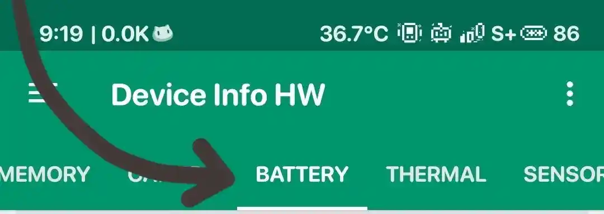
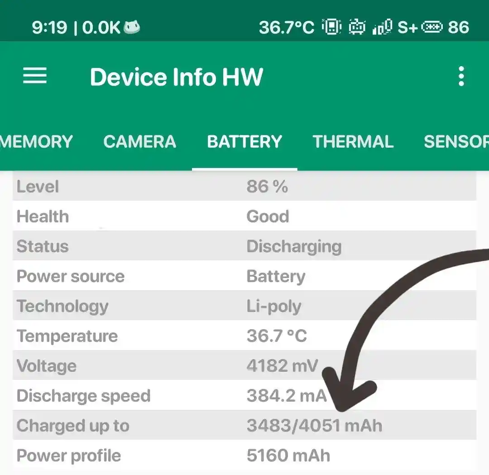

Some of you might wants to see how much capacity of your android battery currently has left since using the device. So, here's a way to see what the current battery capacity is.
# Guides →
1. Install [Device Info HW](https://play.google.com/store/apps/details?id=ru.andr7e.deviceinfohw)
2. Open the app
3. Go to app settings and turn on charge up to
4. Charge your device up to 99% or 100% (Do not unplugged)
5. Open the app and go to **Battery** menu

6. Check the charged up to inside **Battery** menu

7. Done