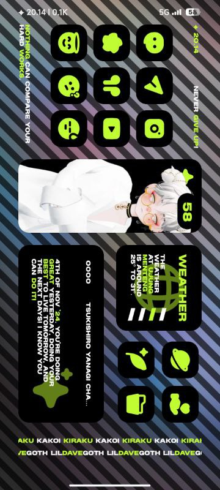
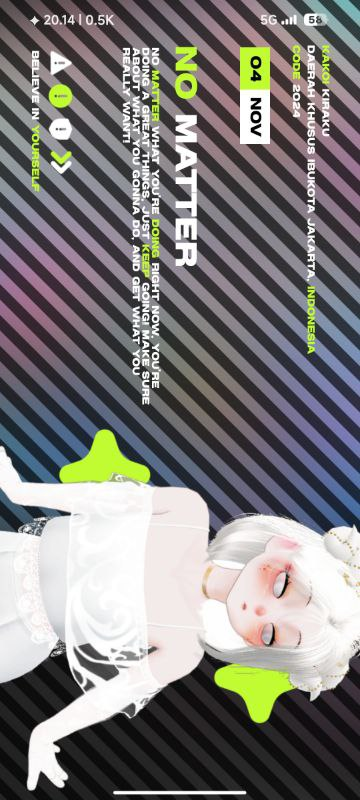

**Kakoi Kiraku** as a **Live Wallpaper**, vibes of a home screen setup, easy to use, customizeable icons and characters, has a gallery widget, 2 screen setups, modern and dark display.

Since there are so few of people made a **KLWP** with landscape display, i will made my own. I know i need learning how to use **KLWP** formula more than ever. So, for this version it will be more simple and easy to use and may be only a few of features.

Always different from the others, this **KLWP** has a landscape setup display with so much positive quotes for your soul.

:::gallery

:::

# Features →
> **Overall**

- The background is animated by default, but you can disable it by click on the warning symbol icons in the first screen.

> **First Screen**

- Date and your country display.
- The code is a years display.
- Big character that you can change to your character, you can even move the character!

> **Second Screen**

- Clickable clock text to open clock app.
- 10 shortcut icons that you can customize freely, and you can change the icon pack with your own icon packs!
- Gallery widget with a battery percentage display inside of it, and images with transparent background is supported.
- Small weather and your current location widget.
- Music time and title widget.
- And also animated username display that you can change to your own username!