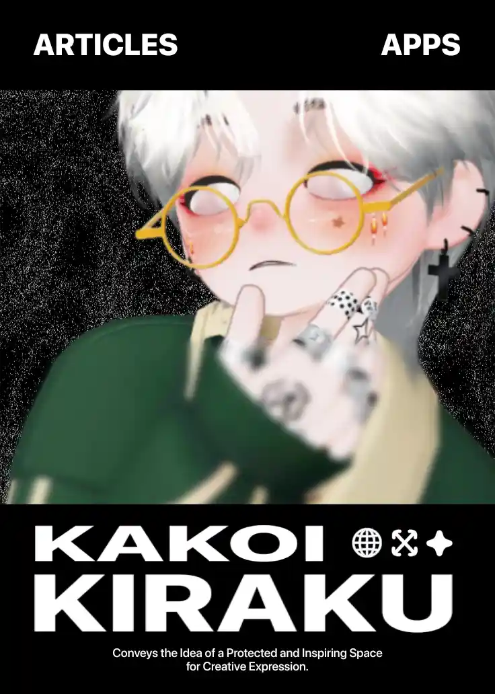

Once again, **Kakoi Kiraku** has been moved to a new web page that i created in [**GitHub**](https://github.com/lildavegoth/lildavegoth) and deployed to **Vercel** for better features, but not only that, in this new **Homepage**, everything is feels brand new, cause it's built by myself and that means i can do anything to the website. In here you'll see so many new stuff that you never seen or used before, and of course it's **Open Source**!

The idea of this website only for **Portfolio** on **GitHub**, but i got so greedy and even changed the concept to a real websites. I've been created so many **Apps** and free **Web Tools**, even **Games**!. Don't see them yet? How could you?! [Go take a look now →](https://kakoi-kiraku-home.vercel.app/)

# Kakoi Kiraku →
At first, **Kakoi Kiraku** was created only for a design posters that i publish and post on [Instagram](https://www.instagram.com/dave_goth), but i do likes my current style and vibes of **Kakoi Kiraku**.

Even i'm doing a bit changes with the **Kakoi Kiraku** vibes, but everything still in the same style as it is, still dark, pure black, highlighter green color, and everything. It's not like a changes, but an updates or an upgrades.
# Projects →
I can't even write the list of all stuff inside **Kakoi Kiraku** project because it's too many of them! But in this **Article** app, it's not just a regular or basic Article Pages anymore, even articles are just a ways for me to express whatever i experiencing and then i pour it out to all of you, that's why in **Article Home** has more tutorials than like a normal articles that recommends you about anything.

# Community →
**Kakoi Kiraku** is also has a **Telegram** and **Discord** community for the discussions, like talks and chats about games, anime, donghua, movies and literally everything! in **Discord**, it has even has a **Kira** bot that can post a confessions to let your feelings out without let people knows who's post (anonymous), and i guess it will available in Telegram community soon.

Do you want to join the communities? Here's the 2 platforms of **Kakoi Kiraku** communities.
- [Discord](https://discord.gg/tPbndvrRDd)
- [Telegram](https://t.me/+Skci4dDZo1A1ZTNl)

Both community has **Kira** bot as your assistant inside the communities!

# Soon →
See you soon in the next updates of new stuff coming based on **Kakoi Kiraku** projects and stay tuned on **[Kakoi Kiraku Home](https://kakoi-kiraku-home.vercel.app/)** page!