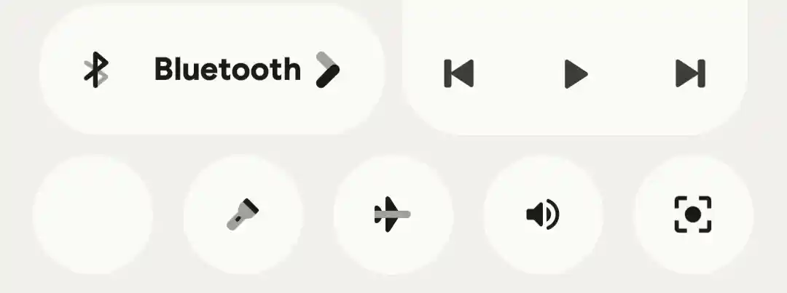
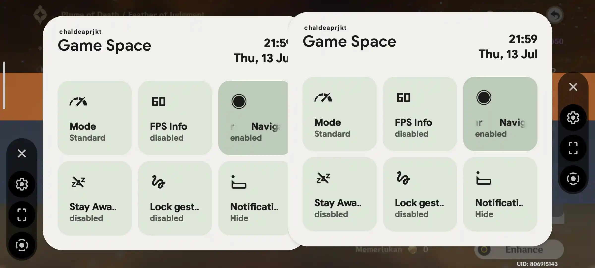
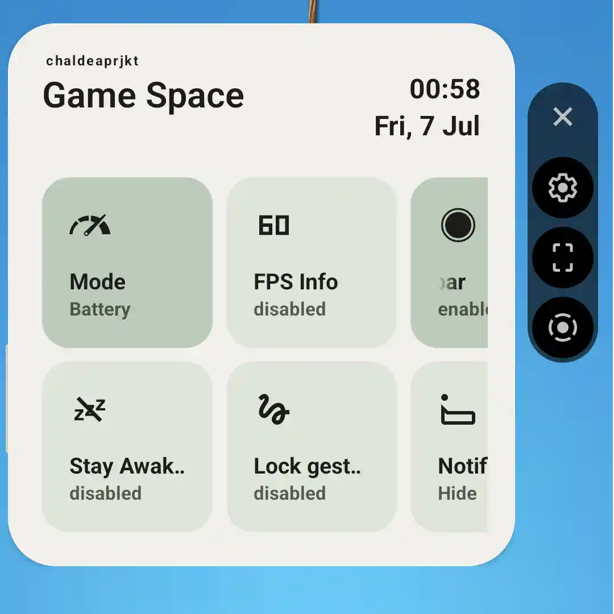

# Nusantara 5.8 →
- qs icon disappear (restart system ui to fix, rarely happens)

- game space bug (rarely happens), double game space (kill game space to fix)

- using back the stock kernel bug, entering the correct password will break the system ui (problem: restore the stock kernel using boot & dtbo)
- reply entry text bug (happens when you already typing and notification appears again in the same conversation)

- qs tile labels after scroll bug (after labels scrolling the labels stays in the middle, oos style)
- lockscreen notification bug

- game space bug in portrait mode

- kill foreground app doesn't work (advanced gesture options, long swipe action feature)

# Nusantara 3.2 →
- can't install app (crash when installing app from third party app)
- can't share anything (crash when sharing something)

# Nusantara LTS 1.1 →
- Dolby digital plus is not supported (for games)
- video duration (record)
- can't install app (crash when installing APK from third party app)
- can't share anything (crash when sharing something)