Usually, some apps has ads to make money, and they're always use personalize, and they're always enable personalize ads privacy as default.
# Details →
**Personalize** or **Personalization** is a feature to collects any data in your activity in their app to improve and better results and relates of ads that appear in your account such as feeds. This feature will always running and active to collects your data, which is not good for your own privacy if you care about it.
# Apps →
**Pinterest**
1. Open **Settings**
2. Go to **Privacy and Data** menu
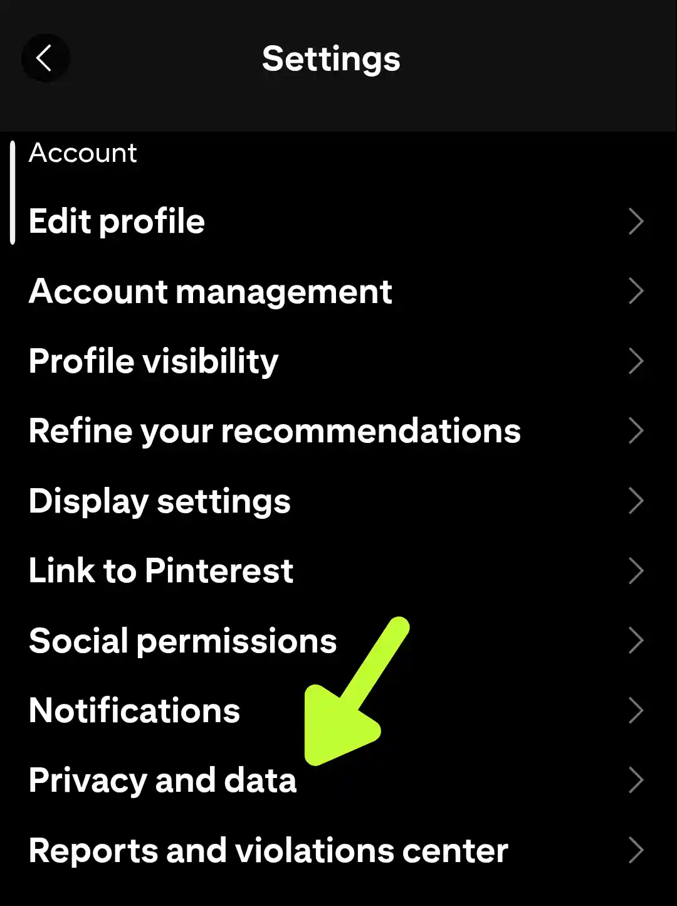
3. Disable everything
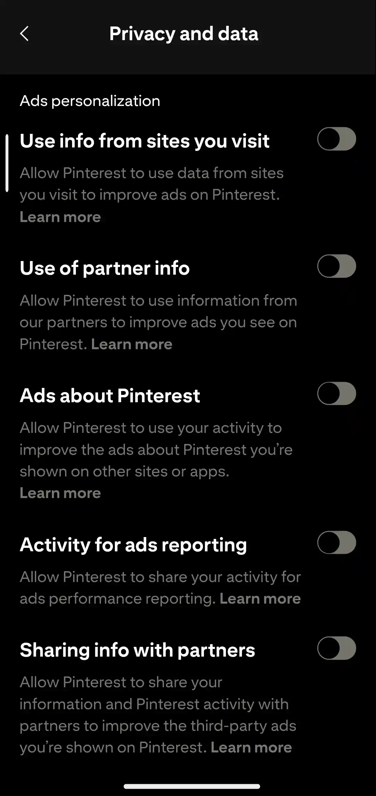

---

**Discord**
1. Open **Settings**
2. Go to **Data & Privacy**
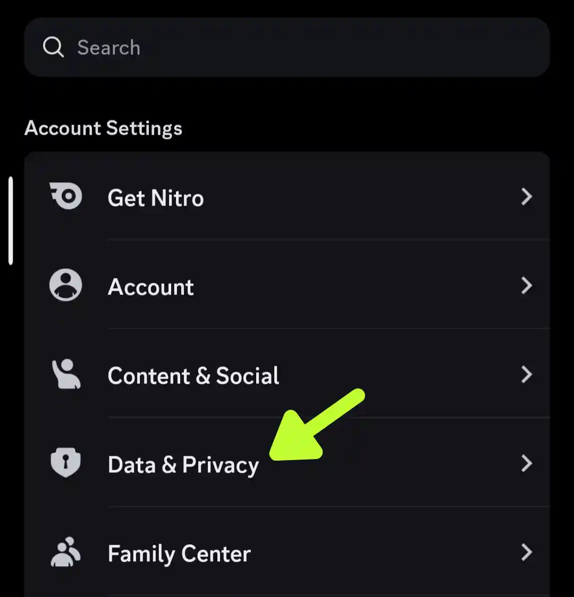
3. Disable everything
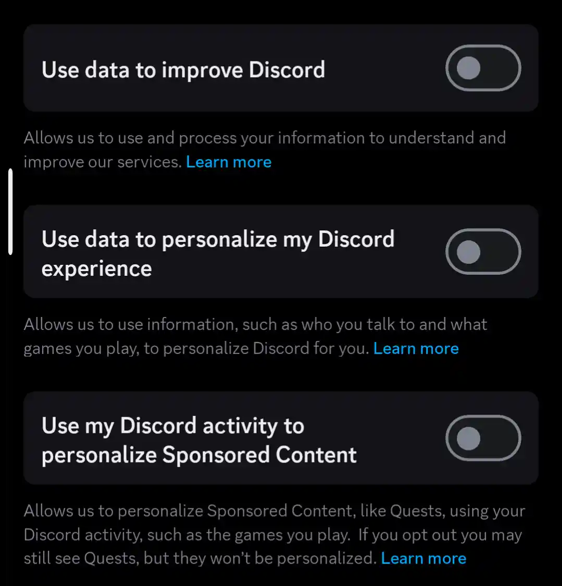

---

**Facebook**
1. Go to [Facebook Account Center](https://accountscenter.facebook.com)
2. Open **Ads Preference**
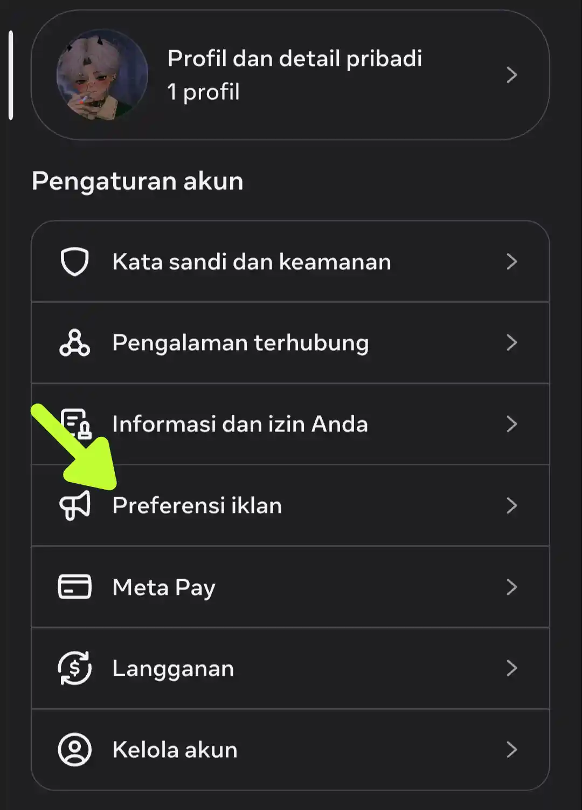
3. Click **Manage Info**
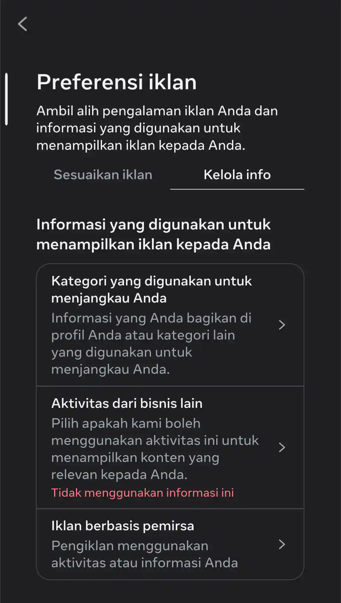
4. Disable everything
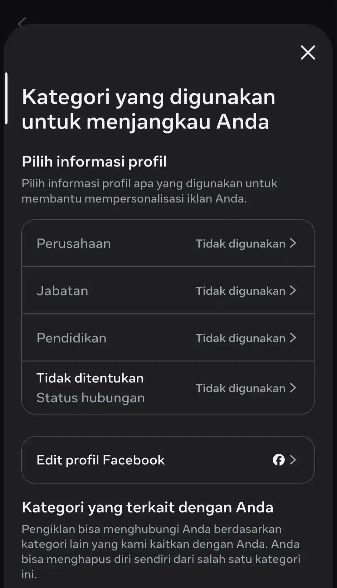

---

**Instagram**
Do the same like **Facebook**, [Instagram Account Center](https://accountscenter.instagram.com).

---

**Telegram**
Unfortunately, there's nothing you can do to block or protect your privacy from Telegram, yeah it's creepy but that's the truth.

---

**Google**
1. Go to your Google account **[Settings](https://myaccount.google.com)** and open **Data & Privacy**
:::gallery
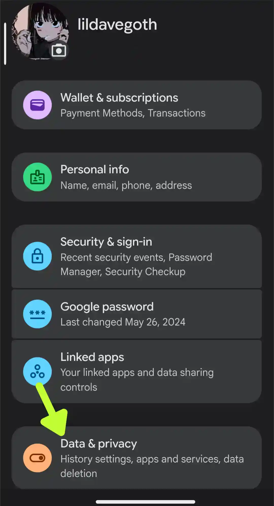
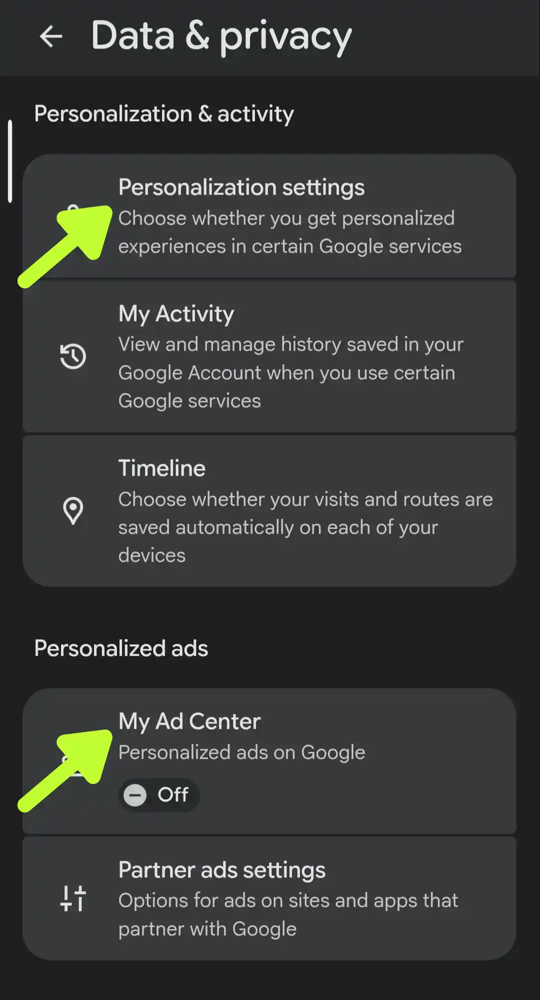
:::
2. Disable everything except you needed like YouTube History (Because if YouTube History is disabled, it will automatically pause the Histories of any videos you're watching, it will not added to the history list at all)
:::gallery
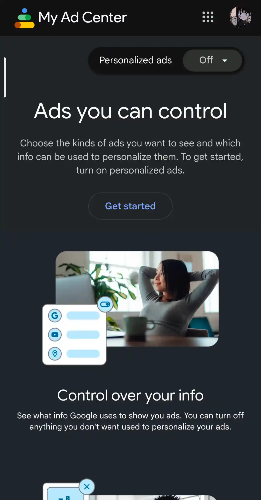
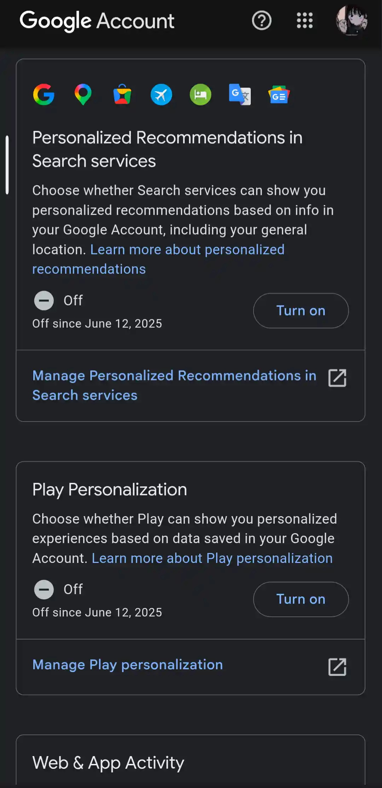
:::

---

**Plants vs Zombies Heroes**
1. Open the game and go to settings
2. Open Help & About menu
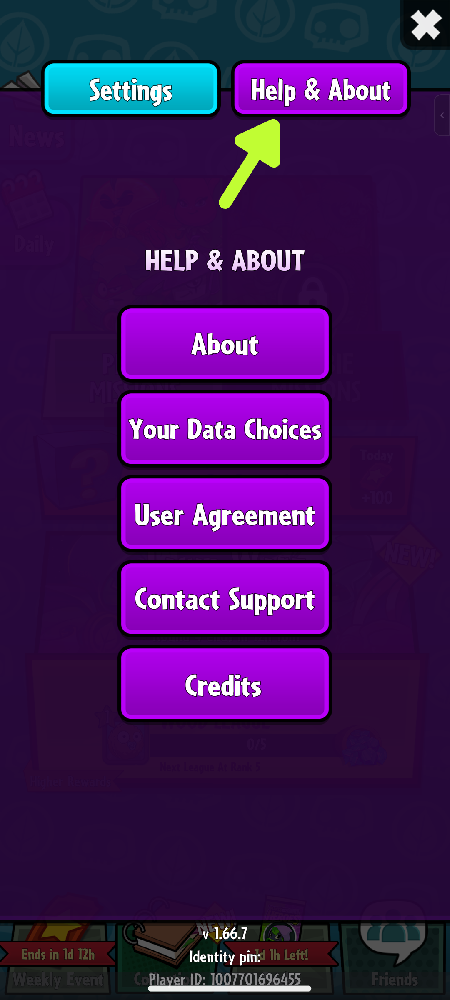
3. Disable them both
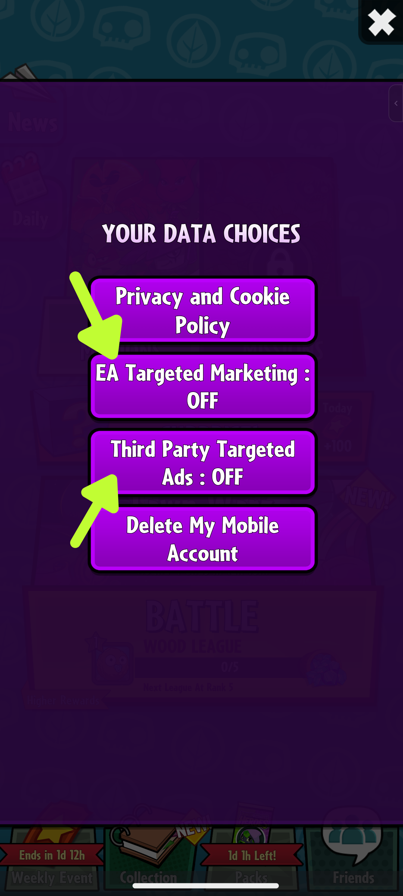