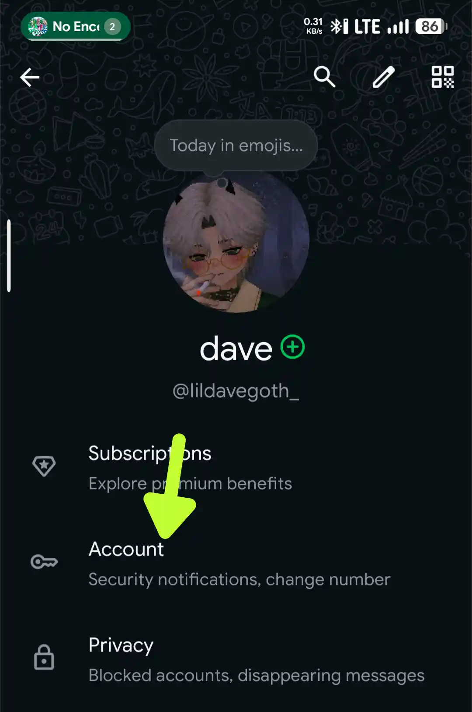
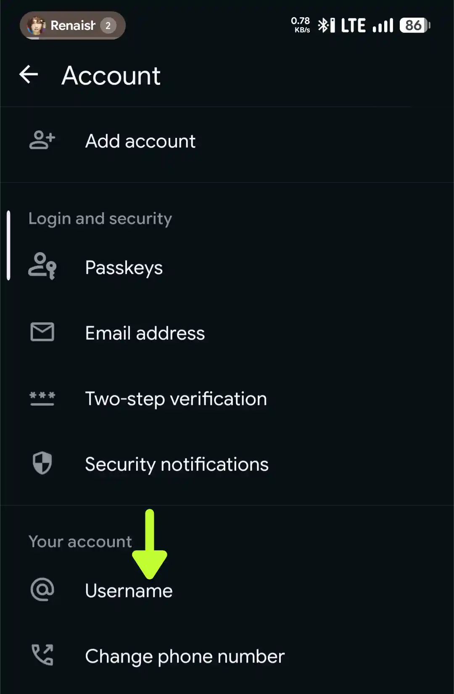
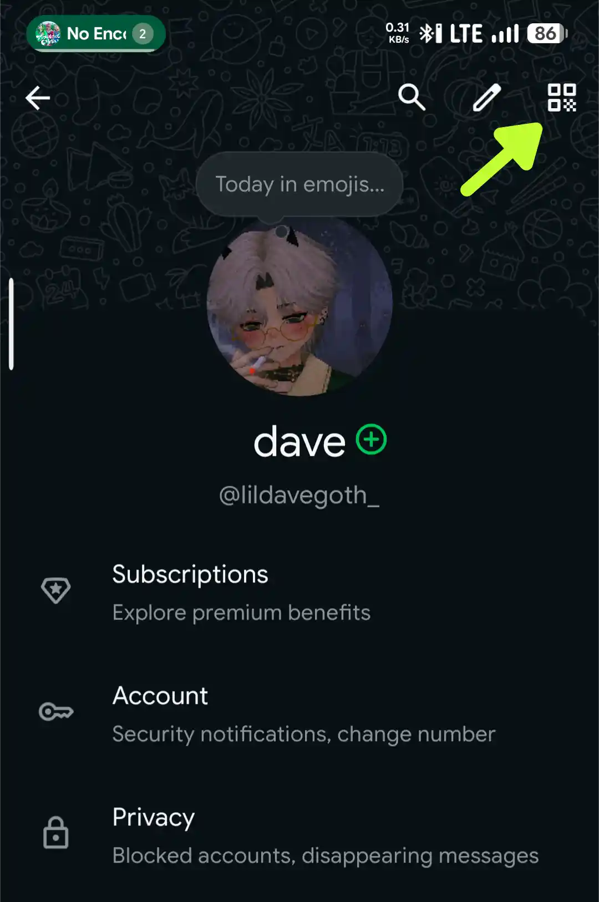
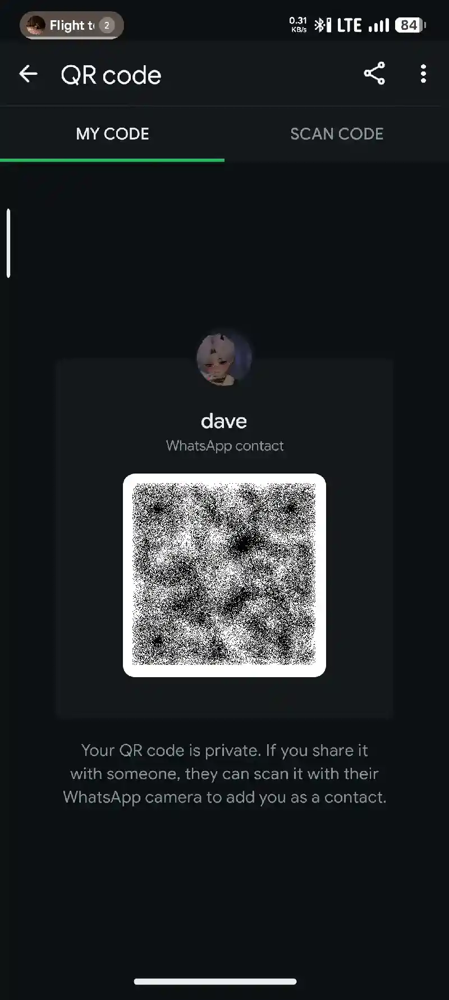
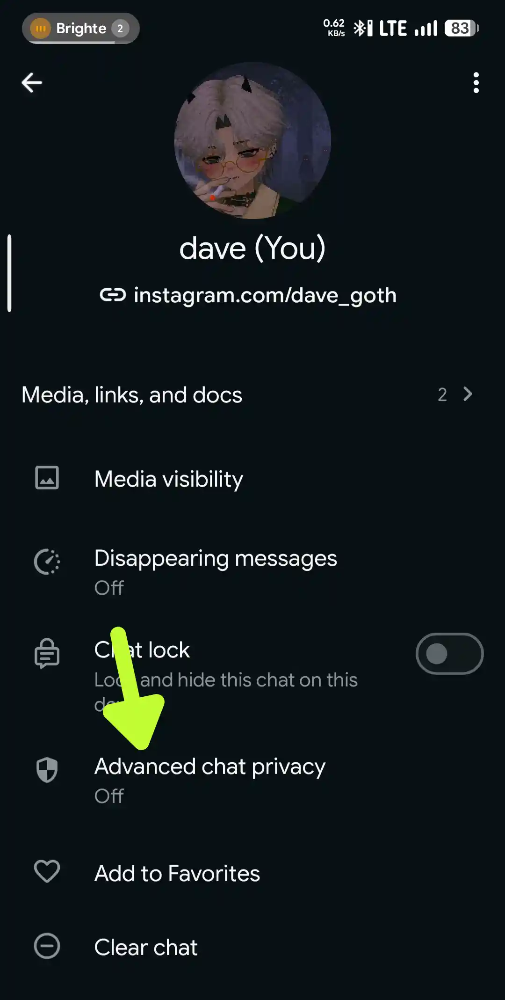
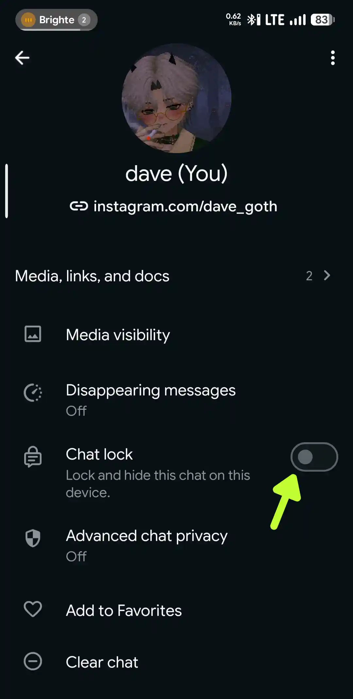
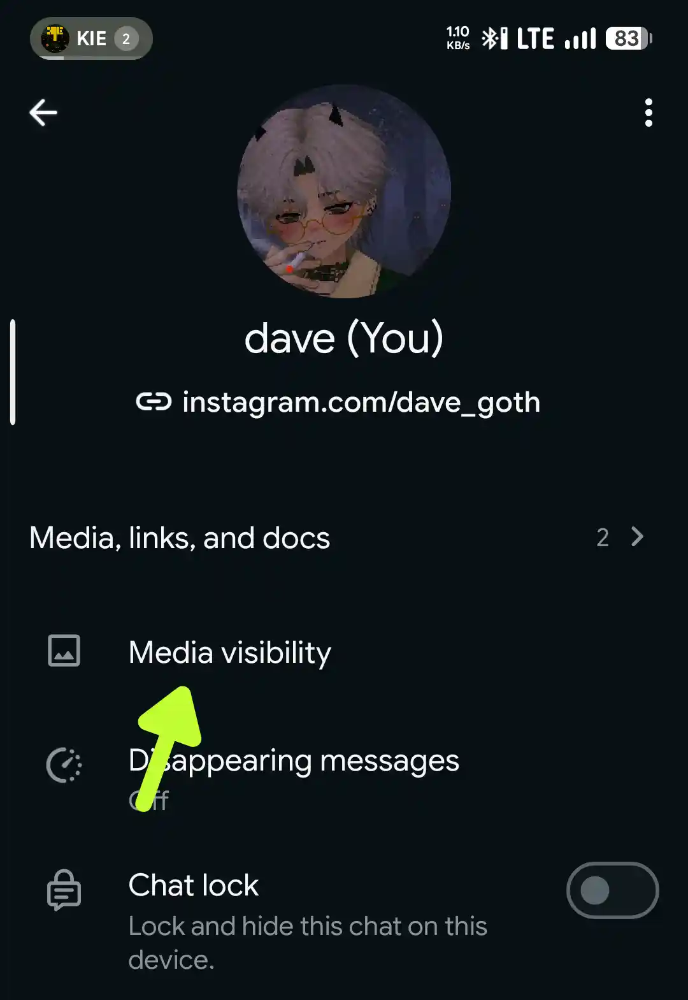

Some of WhatsApp users has only use WhatsApp for chats, talks and video calls with their friends and family, but there's so many free features WhatsApp serves for everyone, and you might not knowing them at all.
# Features →
**Username**
This is the newest updates and features will be added to WhatsApp, but in latest version of WhatsApp, you can reserve your own username to use in the future when it's released.
1. Go to WhatsApp **Settings**
2. Open **Account** menu

3. Open **Username** menu

4. Set your own Username there, if the username doesn't available, try to add numbers or symbols

**Notes**
This feature will only available in latest WhatsApp version, i currently using WhatsApp 2.26.24.5 Beta Version.

---

**QR Code**
Did you know that WhatsApp also has QR Code feature like other social apps? This feature was made for easier to do mutuals like you don't needs to type your friend numbers, just ask him to open their QR Code and then you scan it, it's faster than you type their numbers.
1. Open WhatsApp **Settings**
2. Click **QR Code** icon on top right corner

3. Select **MY CODE** to share your QR Code and let other users to scan you. Select **SCAN CODE** to Scan your friends QR Code to save their numbers.

---

**Protect Privacy from AI**
AI can read your entire chats with anyone to use Meta AI, you can disable this from the chats settings.
1. Open any chats and open the settings menu (Click their Profile or Name)
2. Click on **Advanced chat privacy**

3. Turn the toggle **On**

---

**Lock Chat**
You have a very sensitive chats with your friends or family and don't want anyone to suddenly read it from notification or else? Just Lock it, it will hides the entire chats from notification and conversations list.
1. Open any chats and open the settings menu (Click their Profile or Name)
2. **Enable** the **Chat lock** toggle

3. If the chat is inside **Archived** list, you'll be asked to let it out first, after that you need to verify your fingerprints (If exists, if not, you can use PIN)

**Notes**
You'll always be asked to unlock the chat every time exit from WhatsApp.

---

**Media Visibility**
Media Visibility was made to protect your privacy from gallery apps, like literally hides the entire media (Images & Videos) from a Group or Friends so it will not appear in any Gallery apps.
1. Open any chats and open the settings menu (Click their Profile or Name)
2. Click **Media Visibility** menu

3. When the popup appear, it's always set to **Default (Yes)**, you can set it to **No** to make the Media hidden from your Gallery apps.
